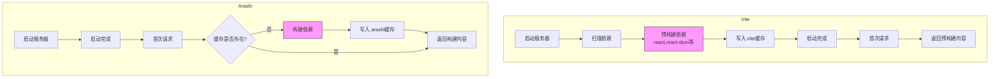

# Arashi Builder

一个用 Rust 实现的简单版 Vite，用于学习 Vite 的核心原理和 Rust 的异步编程。

> 🦀 [Rust 学习笔记](./rust-learning.md) - 记录了项目中的 Rust 编程实践和心得

## 核心功能

1. **开发服务器**
   - 基于 Tide 的异步 Web 服务器
   - 支持静态文件服务
   - 支持模块热重载（HMR）

2. **依赖预构建**
   - 按需构建策略
   - 使用 esbuild 进行依赖打包
   - 缓存机制（.arashi/deps）

3. **TypeScript/JSX 支持**
   - 使用 deno_ast 进行实时转换
   - 支持 .ts, .tsx 文件

## 技术要点

1. **中间件**
   ```rust
   // 三个核心中间件
   app.with(DependencyAnalysis::new(working_dir.clone()).await);  // 依赖处理
   app.with(TypescriptTransform::new(working_dir.clone()));       // TS 转换
   app.with(CssTransform::new(working_dir.clone()));              // 处理 CSS
   app.with(StaticFiles::new(working_dir.clone()));              // 静态文件
   ```

2. **依赖处理策略**
   - 路径重写：将 bare imports 转换为 /@modules/ 路径
   - 按需构建：首次请求时构建依赖
   - 并发控制：使用 RwLock 和 HashSet 处理并发构建请求

## Vite vs Arashi 功能对照

| 环境 | Vite | Arashi |
|------|------|--------|
| Dev | • 启动时预构建依赖 (.vite 缓存)<br>• 原生 ESM + 按需编译<br>• 完整模块图分析<br>• 精确的 HMR<br>• 状态保持<br>• esbuild 即时转换 TS/JSX<br>• CSS 即时处理<br>• CSS HMR<br>• 智能资源导入<br>• 插件系统 + 高度可配置<br>• 精确的错误提示和源码映射 |  • 按需构建依赖 (.arashi 缓存) ✅<br>• 原生 ESM + 基础路径重写 ✅<br>• 简单路径匹配 <br>• 不支持 HMR ❌<br>• 不支持状态保持 ❌<br>• deno_ast 转换 TS/JSX ✅<br>• CSS 即时处理 ✅<br>• 基础静态文件服务 <br>• 无插件系统 ❌<br>• 硬编码配置 <br>• 基础错误提示  |
| Prod | • Rollup 全量打包<br>• 代码分割 + 智能分包<br>• 资源优化 + CDN 集成<br>• CSS 提取 + 压缩<br>• 产物体积优化<br>• 环境变量注入<br>• 完整的构建管线 | • 不支持生产构建 ❌<br> |


### 冷启动流程对比



### 流程特点对比

1. **启动阶段**
   - Vite: 预构建常用依赖，启动较慢但后续请求快
   - Arashi: 直接启动，速度快但首次请求可能较慢

2. **首次请求**
   - Vite: 直接返回预构建内容，响应快
   - Arashi: 可能需要等待构建，响应较慢

3. **缓存策略**
   - Vite: 启动时建立完整缓存
   - Arashi: 按需构建并缓存


